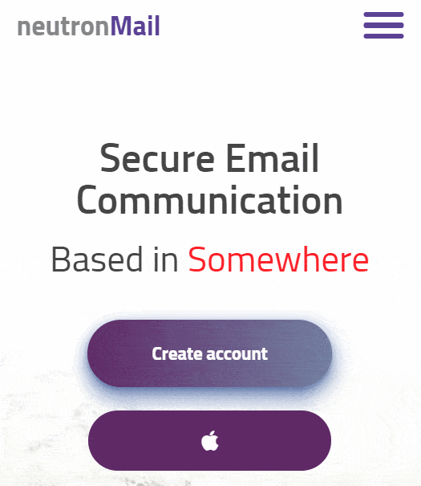

# neutronMail (landing page markup)

Deployed version: [tppd67421.github.io/neutron-mail](https://tppd67421.github.io/neutron-mail/)

## Technologies used
- SCSS;
- Webpack;
- Swiper (slider).

## Project description

This page was be created Pixel Perfect from PSD layout. All elements have interactive and css transition (buttons, links, etc). Page responsive for all screens. In this project used Flexbox css and Grid css.

On mobile version has hamburger menu.

